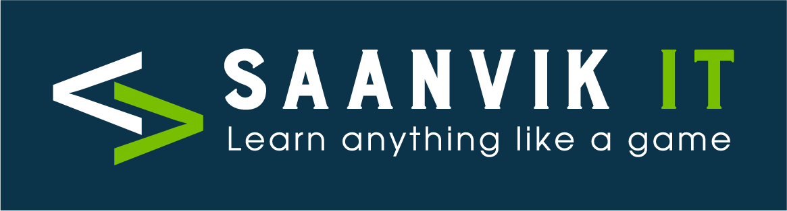

  
  <h1>🧠 Azure AI Training Course</h1>
  
<em>A comprehensive guide to Azure AI services and Generative AI</em>

  
<strong>Website:</strong> <a href="https://saanvikit.com">https://saanvikit.com</a> | <strong>Contact:</strong> +91 9513184144

  

## 📋 Table of Contents
- [Course Overview](#course-overview)
- [AI Fundamentals](#ai-fundamentals)
- [Azure AI Services](#azure-ai-services)
- [Generative AI with Azure OpenAI](#generative-ai-with-azure-openai)
- [Projects & Hands-on Labs](#projects--hands-on-labs)

## 🌟 Course Overview

This comprehensive training program covers the fundamentals of AI and Generative AI on the Azure platform. The course is designed to prepare you for Azure AI certification (AI-102) while providing hands-on experience with Azure's AI services.

### 🎯 Learning Objectives

- Understand core concepts of AI, ML, DL, and Generative AI
- Develop practical skills with Azure AI services
- Create generative AI solutions with Azure OpenAI Service
- Build computer vision and natural language processing solutions
- Prepare for Azure AI-102 certification

## 🤖 AI Fundamentals

### 📚 AI/ML & GenAI for Beginners

**Topics Covered:**
- 🧩 Overview of AI, ML, DL, and GenAI
- 🔄 Comparison: AI vs ML vs DL vs GenAI
- 🧮 Machine Learning vs Traditional Programming
- 🧪 Types of Machine Learning:
  - Supervised Learning
  - Unsupervised Learning
  - Reinforcement Learning

## ☁️ Azure AI Services

### 🚀 Introduction to AI and AI on Azure

**Topics Covered:**
- 🌐 Introduction to AI
- 🛠️ Azure AI Services Overview

**Lab:** Exercise - Get Started with Azure AI Services

### 👁️ Develop Computer Vision Solutions with Azure AI Vision

**Topics Covered:**
- 🖼️ Analyze and manipulate images

**Lab:** Exercise - Analyze Video

### 🔤 Develop Natural Language Processing Solutions

**Topics Covered:**
- 📝 Analyzing and translating text

**Lab:** Exercise - Analyze Text

### 🔍 Creating a Knowledge Mining Solution

**Topics Covered:**
- 🧠 Implementing an Intelligent Search Solution

**Lab:** Exercise - Create an Azure Cognitive Search Solution

### 📄 Develop Solutions with Azure AI Document Intelligence

**Topics Covered:**
- 📑 Use prebuilt Document Intelligence models

**Lab:** Exercise - Use prebuilt Document Intelligence models

## 🤖 Generative AI with Azure OpenAI

### 🧠 Develop Generative AI Solutions with Azure OpenAI Service

**Topics Covered:**
- 🚀 Get started with Azure OpenAI Service

**Lab:** Exercise - Get started with Azure OpenAI

### 💻 Generate Code with Azure OpenAI Service

**Topics Covered:**
- 👨‍💻 Generate code with Azure OpenAI Service

**Lab:** Exercise - Code Generation

## 🔬 Projects & Hands-on Labs

### 🎯 Azure AI Project

**Topics Covered:**
- 📣 AI-Enhanced Advertisement Generation

**Project:** AI-Enhanced Advertisement Generation

## 📜 Certification Preparation

This course helps prepare you for the following Azure certification:

### 🏆 AI-102: Azure AI Engineer Associate
- Develop computer vision solutions
- Develop natural language processing solutions
- Develop knowledge mining solutions
- Develop generative AI solutions

  
<strong>Ready to start your Azure AI journey?</strong>

  
Contact us at <a href="https://saanvikit.com">https://saanvikit.com</a> or call +91 9513184144

